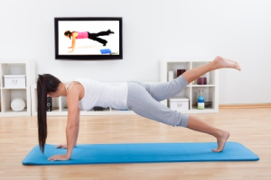

#EJERCICIOS EN CASA
##¿Por qué es tendencia hacer ejercicio en casa?

**Ahorrarás tiempo:** 
Hacer ejercicio en casa y no tener que desplazarte a un centro deportivo es ideal para aquellas personas que andan justas de tiempo. Con ictiva, podrás realizar tus ejercicios diarios una vez acabes tu jornada laboral o incluso antes, además las videosesiones no sobrepasan los 30 minutos de duración.

**Proximidad:**
Obviamente, el hecho de tener tu gimnasio en tu propia casa y no tener que desplazarte hace que ahorres en tiempo, como hemos comentado en el punto anterior, y también hace que ahorres económicamente evitando los desplazamientos.

**No sentirás vergüenza:**
Hay muchas personas que nunca han hecho ejercicio o alguna disciplina en concreto y les da vergüenza practicarlo delante de gente. En ictiva, tenemos clases para todos los niveles y además podrás hacerlo sol@ sin que nadie te vea. También podrás hacer ejercicio tranquilamente sin que nadie te moleste y repetirlo tantas veces como quieras.
